# DIU22
Prácticas Diseño Interfaces de Usuario 2021-22 (Tema: Hostels) 

Grupo: DIU1_Sigma.  Curso: 2021/22 
Updated: 11/2/2022

Proyecto: 
>>> LIMA HOUSING

Descripción: 

>>> El proyecto consistirá en volver a abrir las habitaciones pero con el añadido de que algunas
de ellas tendrán una decoración musical temática que irá cambiando a lo largo del tiempo
con el objetivo de atraer y captar a los clientes interesados en dicha temática, además de
instar a otros que ya hayan estado en el local (o se hayan alojado) a disfrutar de otra
temática diferente, con el beneficio extra de que dichos clientes se conviertan en
comensales del restaurante o espectadores de los eventos que se realicen en el local.

Logotipo: 
>>> 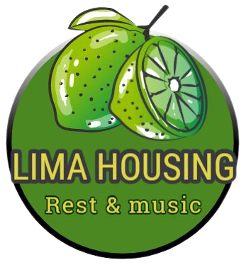

Miembros
 * :bust_in_silhouette:   Daniel Pérez Ruiz     :octocat:     
 * :bust_in_silhouette:  Emilio Vargas Ibáñez     :octocat:

-----

# Proceso de Diseño 

## Paso 1. UX Desk Research & Analisis 

 1.a Competitive Analysis
-----

>>> El local desde hace unos meses ha dejado de ser un hostel para dedicarse unicamente a la restauración, es un sitio que concentra gente joven y dedican especial importancia a la música en
>>> directo durante las comidas, se centran en platos elaborados de precio no muy elevado y copas. La página web se centra sobre todo en mostrar la comida y el ambiente con gran cantidad
>>> de imágenes, está bien hecha, no hemos encontrado bugs, pero para hacer una reserva hay que ir a una página externa lo cual puede ser un poco molesto ya que si queremos volver atrás
>>> debemos hacerlo desde las flechas del navegador. Además en la propia página de la reserva no parece que tenga ningún método para impedir datos erróneos como que la reserva vaya a nombre de una cadena de números

 1.b Persona
-----

>>> ### Olivia
>>>
>>> La hemos elegido ya que es una chica joven, que encaja en el perfil de las personas que suelen ir al LemonRock según hemos observado en redes sociales, puesto que es una persona a la que le gusta mucho hacer amigos y conocer gente, por tanto puede ser un lugar atractivo para alguien como ella.
>>> En cuanto al perfil psicológico, hemos recreado el caracter de una persona que espera que sus trámites por internet se resuelvan sin inconvenientes, ya que de lo contrario le produce inquietud, frustación, y una alta tendencia a rechazar aquellos lugares donde la navegación no sea cómoda. Se verá más detalladamente este concepto en el Exp Journey Map.
>>>
>>> 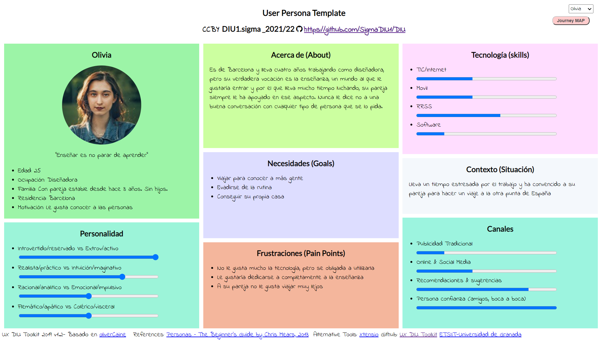
>>> 

>>> ### Enrique
>>>
>>> Es un hombre que disfruta de salir siempre que puede y que está acostumbrado a viajar, además de ser un amante de la comida, por tanto personas como él pueden verse atraidas por este tipo de locales cuya oferta se centra en la "espontaniedad" y el flujo constante de gente.
En cuanto al perfil psicológico, a diferencia del otro personaje, es una perosna que tiene un claro manejo de las tecnologías TIC, y es capaz de comprender, analizar y resolver de forma
propia los inconvenientes que puedan surgir.
>>>
>>>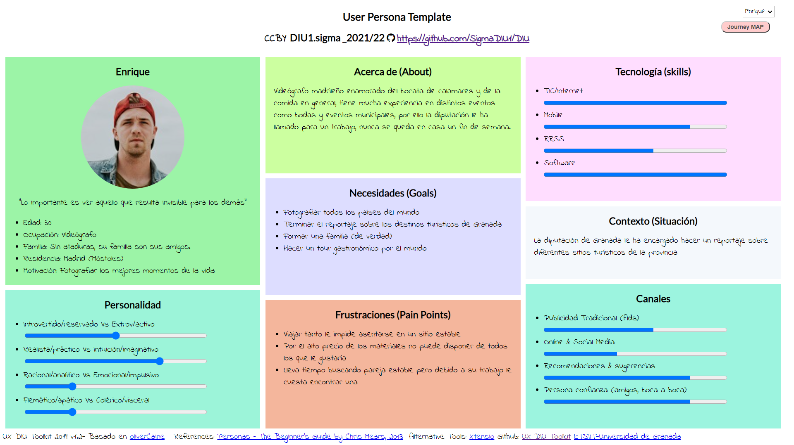
>>>

 1.c User Journey Map
----

>>> ### Olivia
>>> Hemos querido recrear los pasos que seguiría para buscar un alojamiento una persona que no tiene mucha idea de tecnologías y cuya principal influencia es su círculo más cercano,
al ser una persona más emocial sus conflictos le afectan más al no poder reservar comodamente, lo que hace que personas como ella puedan acabar rechazando el sitio. 
>>>
>>>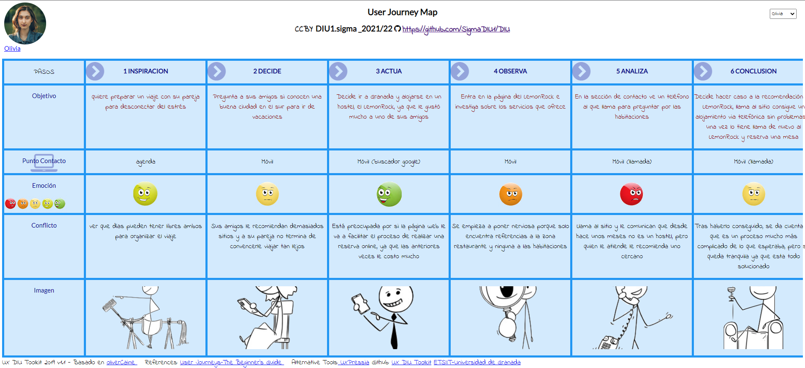
>>>

>>> ### Enrique
>>> Ya que tiene amplio conocimiento sobre las tecnologías y sabe usarlas hemos querido hacerle usar sitios web de terceros para buscar alojamiento, por ello no le cuesta encontrar el
LemonRock y descubrir en su página que ya no ofrecen servicio de hostel, en cuanto a sus emociones al ser una persona más racional es capaz de buscar alternativas fácilmente, este
tipo de personas pueden ver más alla de que simplemente ya no sea un hostel y reservar ahí igualmente porque les gusta la comida y el ambiente que muestra. 
>>>
>>>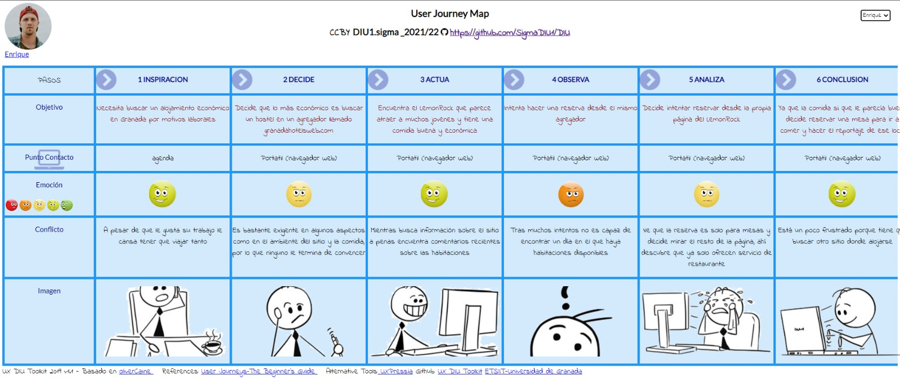
>>>

 1.d Usability Review
----
>>>  Documento con los detalles de la valoración: 
>>>[Documento valoración](P1/DOCS/DIU1.SIGMA_P1_(EXCEL).xlsx)
>>>  
>>> La página ha obtenido como calificación numérica final un total de 86/100
>>> 
>>> En términos generales la interfaz de la página web cumple con las expectativas: el contenido que la empresa quiere ofertar está claro, y es accesible, y dispone de formas sencillas, con un estilo limpio y concreto, de acceder a los diferentes servicios. Concluimos también que el encabezado puede ser un poco grande en proporción con el cuerpo de la página, y también puede presentar algunos problemas de visionado de contenido con algunas transparencias que se proudcen en la barra de navegación situada también en el encabezado. La página dispone de información suficiente como para localizar adecuadamente el sitio mostrando diferentes formas de acceso (en coche por autovía, desde el aeropuerto, desde estación de autobuses...) además de emails, tlf y formularios de contacto, aspecto que puede ser clave para que el cliente decida ir al lugar.

En cuanto a las herramientas utilizadas en la página web, podemos ver que el contenido es totalmente dinámico, con carruseles de vídeos, imágenes, etiquetas llamativas, transiciones de textos, aspecto que ayuda a que la experiencia del usuario navegando con la página, sea más relajada. Además, la disposición de los elementos y la sencillez de la web, hace que cualquier usuario pueda utilizarla sin importar cuál sea su nivel de conocimiento en tecnologías TIC, aunque no se menciona en ningún momento el hecho de que LemonRock ya no es un hostel y no dispone de alojamientos, factor que podría ser advertido con un cuadro de diálogo a la hora de realizar una reserva, o una sección a parte, evitando así que ciertos clientes se sientan "engañados" si visitan portales de terceros con información obsoleta.

## Paso 2. UX Design  

 2.a Feedback Capture Grid / EMpathy map / POV
----

>>>  

>>> El proyecto consistirá en volver a abrir las habitaciones pero con el añadido de que algunas de ellas tendrán una decoración musical temática que irá cambiando a lo largo del tiempo con el objetivo de atraer y captar a los clientes interesados en dicha temática, además de instar a otros que ya hayan estado en el local (o se hayan alojado) a disfrutar de otra temática diferente, con el beneficio extra de que dichos clientes se conviertan en comensales del restaurante o espectadores de los eventos que se realicen en el local.

 2.b ScopeCanvas
----
>>> 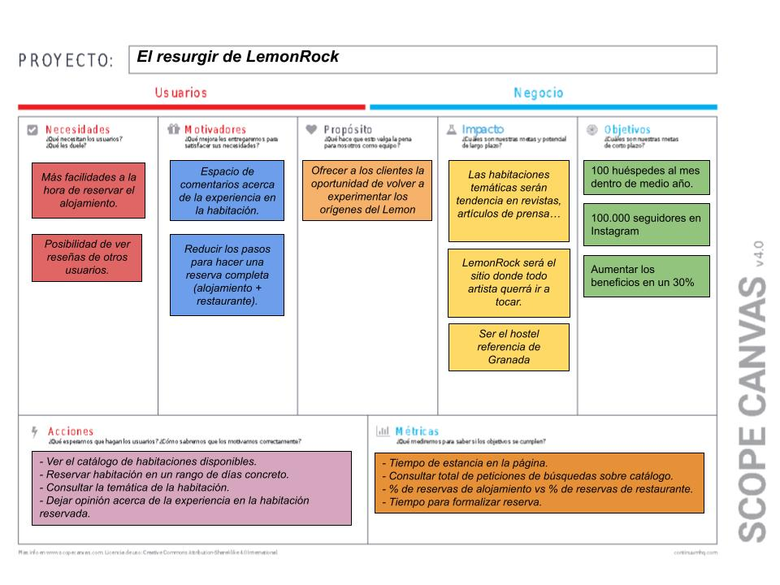 

 2.b Tasks analysis 
-----

>>> Hemos optado por una matriz de tareas, en total tenemos un total de 12 de acciones que puede realizar el usuario que navega por el microsite, las hemos clasificado con tres valores: H (prioridad alta), M (prioridad media) y L (prioridad baja), las casillas marcadas en gris oscuro son las tareas críticas y los grupos de usuarios más importantes.
>>> 
>>> 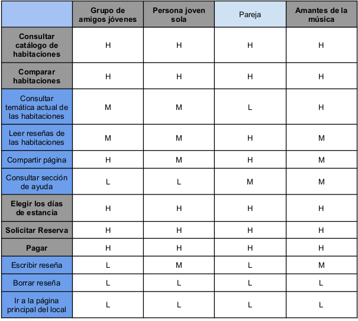

 2.c IA: Sitemap + Labelling 
----

>>>Este es el grafo con la estructura de nuestro microsite. Disponemos de 4 secciones bien
diferenciadas entre las que el usuario podrá interaccionar: Temáticas para consultar las
temáticas actuales y anteriormente ofertadas sobre las habitaciones; Reservar para realizar
una reserva de la habitación, Habitaciones para que el usuario pueda visualizarlas y Ayuda, sección dedicada a preguntas frecuentes y un formulario de contacto.
>>>
>>>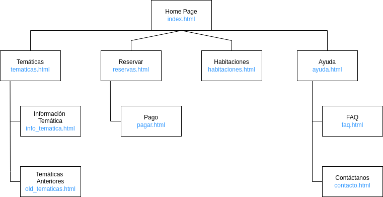
>>>
>>> Expondremos las principales etiquetas que hemos usado en nuestro
microsite y una breve descripción para comprender la finalidad de cada una.
>>>
>>> 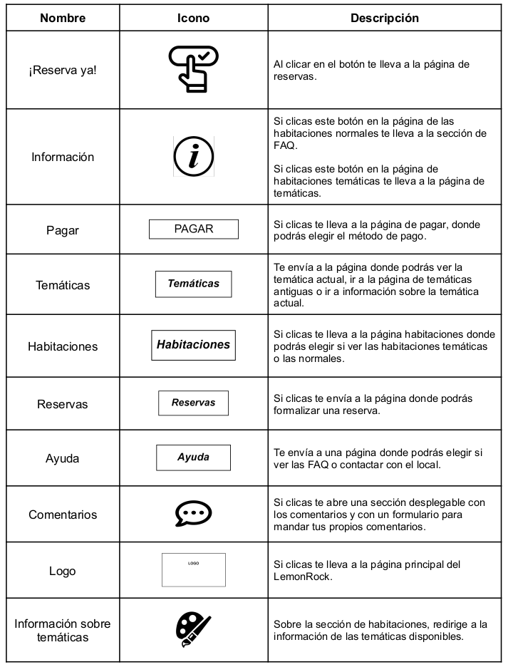

 2.d Wireframes
-----

>>> Todas las páginas del microsite contienen una cabecera (Header) con una barra de navegación para moverse cómodamente entre las diferentes secciones bien definidas: Temática, Habitaciones, Reservar, Ayuda. Además, pulsar en el logo redirige a la página principal del sitio oficial de LemonRock.
>>> También se dispone de un pie de página (Footer) en el que se contiene información básica
>>> acerca de cuestiones intrínsecas de la propia web (política de privacidad, cookies almacenadas, aviso legal), además de información referente al local, y redirección a redes sociales.
>>>
>>> Información completa en [bocetos](P2/Bocetos/DIU1.Sigma_Bocetos.pdf).
>>>
>>>.drawio.png)
>>>
>>>.drawio.png)
>>>
>>>.drawio.png)
>>>
>>>.drawio.png)
>>>
>>>.drawio.png)
>>>
>>>.drawio.png)
>>>
>>>.drawio.png)
>>>
>>>.drawio.png)
>>>
>>>.drawio.png)
>>>
>>>.drawio.png)

## Paso 3. Mi UX-Case Study (diseño)

 3.a Moodboard
-----

>>>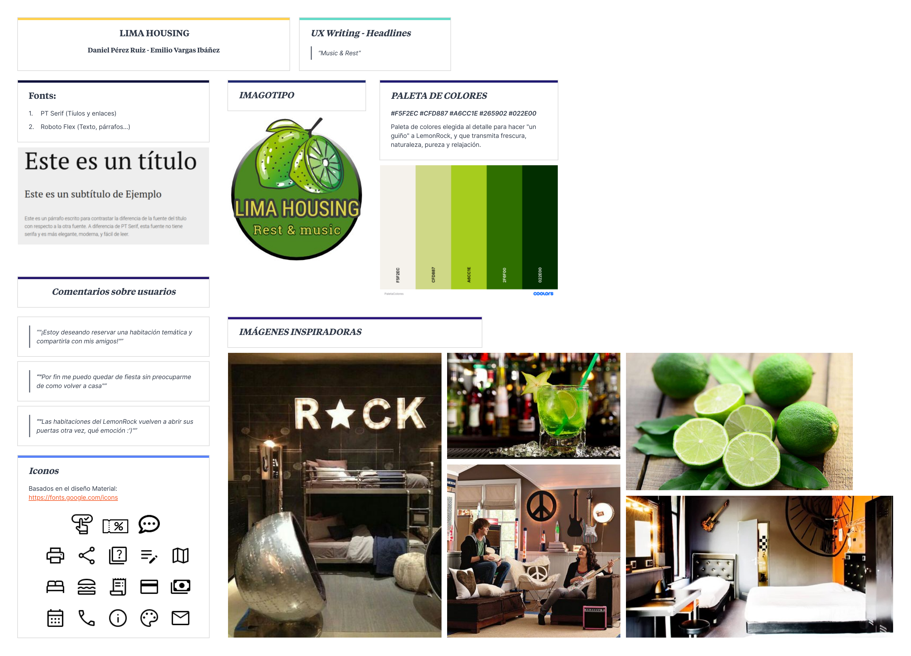
>>>
>>>Con respecto al imagotipo realizo:
>>> - El nombre de proyecto está cuidadosamente escogido con la motivación de realizar,
en primer lugar, un guiño al establecimiento de “LemonRock”, con el objetivo de que
el usuario final que utiliza este nuevo servicio, vea que está asociado con el ya
existente (referido y centrado al restaurante y a la música), haciendo la asociatividad
propia de los cítricos “Lima” y “Limón”.
>>>- También sobre el nombre del proyecto: la sonoridad del mismo facilita a que el
usuario pueda recordarlo y pronunciarlo fácilmente, factor importante a la hora de
transmitir información a nuevos y potenciales usuarios.
>>>- Con respecto al eslogan: “Rest & Music”, dejamos claro cual es el objetivo de
nuestro servicio y que se basa en dos premisas: descanso, acompañado de
motivaciones musicales.

  3.b Landing Page
----

>>> Nuestra [landing page](https://lima-housing.webflow.io/) servirá de portada y presentación de nuestro sitio web. En nuestro caso, el diseño de la página es muy
sencillo, la elección de la paleta y tipografías son muy similares a las que usaremos en el
prototipo, para que así el usuario se empiece a familiarizar. Además también presentamos
los beneficios que sugiere hospedarse en nuestro hostel, con testimonios de personas:
>>>
>>> 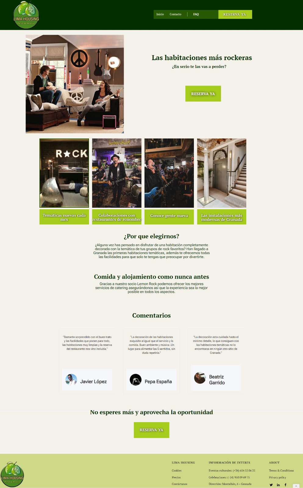

 3.c Guidelines
----

>>> ### Elección de la paleta de colores
>>> 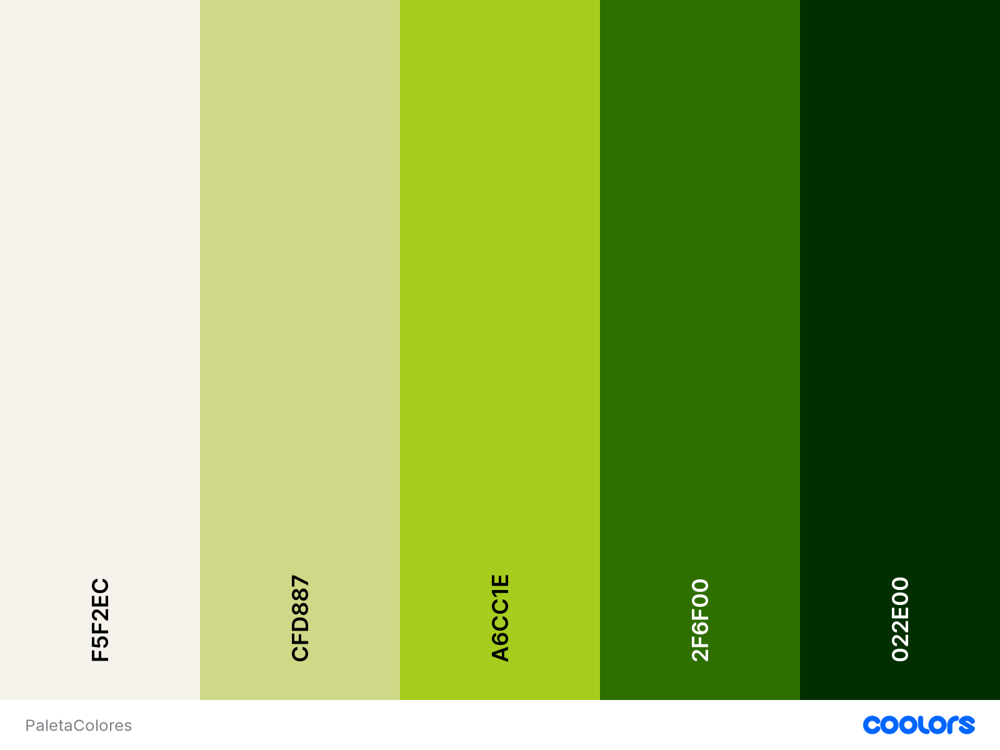
>>> Esta paleta de colores ha sido extraída de una fotografía con muchas limas colocadas sobre una mesa, cortadas y enteras (véase imagen de inspiración). Los tonos más claros se
utilizarán para los fondos de página (contenido principal de la página, y color de la fuente en botones que contengan texto; mientras que los tonos más oscuros serán útiles para header
y footer, además del color de la tipografía de los títulos y otro texto de interés localizado
dentro del content. Así, evitamos cualquier tipo de problema que pueda presentarse con la
legibilidad del texto (incluso a diferentes escalados de página/ redimensión según dispositivo), gracias a este contraste.
Los colores en tonalidad verde transmiten un ambiente natural, relajante, estable, que es
lo que pretendemos cuando un usuario navega: que se encuentre con una interfaz relajada,
tranquila y ligera, al igual que los servicios de hostel que se ofrecen.

>>> ### Elección de tipografía
>>> 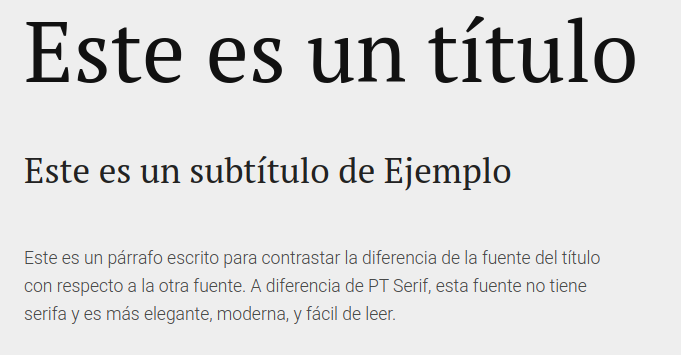
>>> Se han seleccionado dos tipografías diferentes para distinguir entre diferentes elementos de texto de la página:
>>> - PT Serif: Esta fuente es de un estilo más elegante, con serifa, y será útil para
destacar títulos y subtítulos de secciones.
>>>- Roboto Flex: Esta fuente no tiene serifa, es más ligera y con un estilo más
moderno, y será utilizada para párrafos, texto de botones (que lo requieran), etc.

>>> ### Guia de estilos
>>> La guía de estilos sobre la que nos basaremos es la proporcionada por Google
específicamente para aplicaciones WEB ([Material IO for Web](https://material.io/develop/web)), con el objetivo de hacer una
aplicación limpia, moderna, fresca y con elementos claros y fácilmente identificativos.
(Queremos notar que evidentemente esta guía de estilos comparte muchas cosas con su
similar a Android para aplicaciones móviles).
>>>Entre las características más importantes queremos destacar:
>>>1. Uso de iconos Material: El estilo de estos iconos atiende a formas más
geométricas, sin diseños cercanos a formas más humanas, además de tener un
diseño con línea fina principalmente y un tamaño de unos 24x24.
Los iconos que se usarán en la aplicación web, (algunos se mostraron ya en el
MoodBoard) se han obtenido de la página de iconos material de Google [Material Icons](https://fonts.google.com/icons). Estos iconos estarán en todos aquellos sitios donde se requiera, o también para reforzar ciertas acciones (por ejemplo, estarán presentes en las pestañas de la barra de navegación de la cabecera).
>>>2. Uso de las nuevas fuentes de Google: La tipografía elegida también responde a la
guía de estilos, de ahí a que se eligiera PT Serif y Roboto Flex para el contenido.
[Material Fonts](https://m3.material.io/styles/typography/fonts).
>>>3. Uso de componentes estilo Material: Para finalizar, en la subsección anterior
hablábamos sobre los patrones que tienen ciertos componentes de nuestra
aplicación web. Utilizaremos los estilos de diseño Material para componentes web ya
que ofrece esa frescura y modernidad que andamos buscando además de
simplicidad. [Material Compontents 4 Web](https://material.io/components?platform=web).

  3.d Mockup
----
>>>A continuación una muestra de las distintas pantallas de nuestra aplicación web

>>>La página principal
>>>

>>>Las dos páginas del apartado de temáticas, primero la temática actual y a continuación información sobre las anteriores temáticas
>>>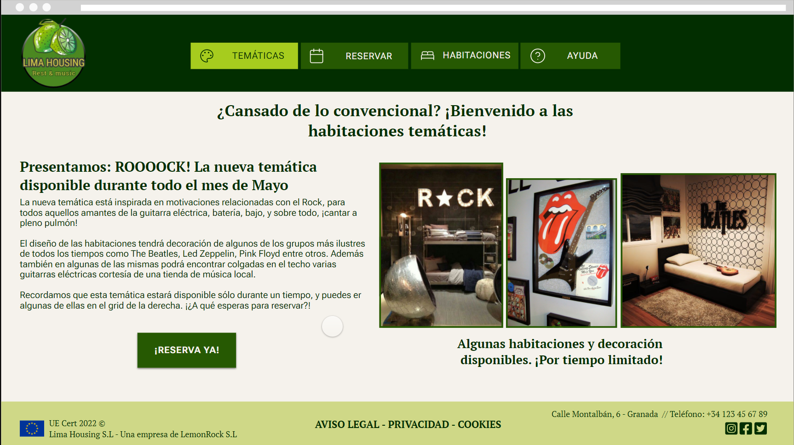
>>>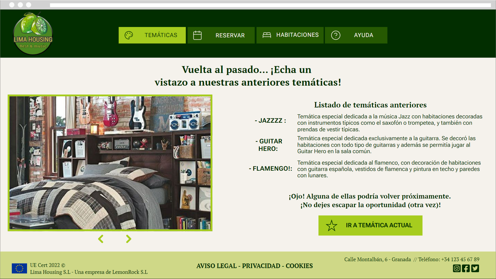

>>>La página de reserva, donde se permite seleccionar la habitación, el tiempo que durará la estancia y si se desea reservar en restaurante
>>>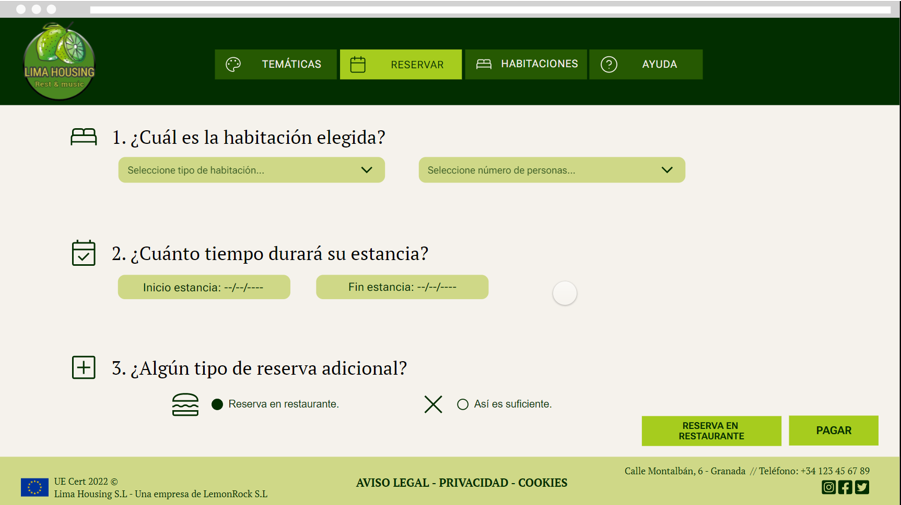
>>>
>>>También en el apartado de reserva, esta vez la ventana de pago
>>>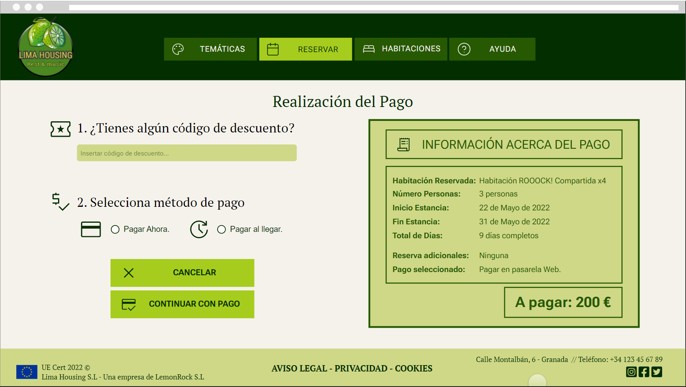

>>>Seguimos por el apartado de habitaciones, donde se podrá ver imagenes de las distintas habitaciones que  no son temáticas
>>>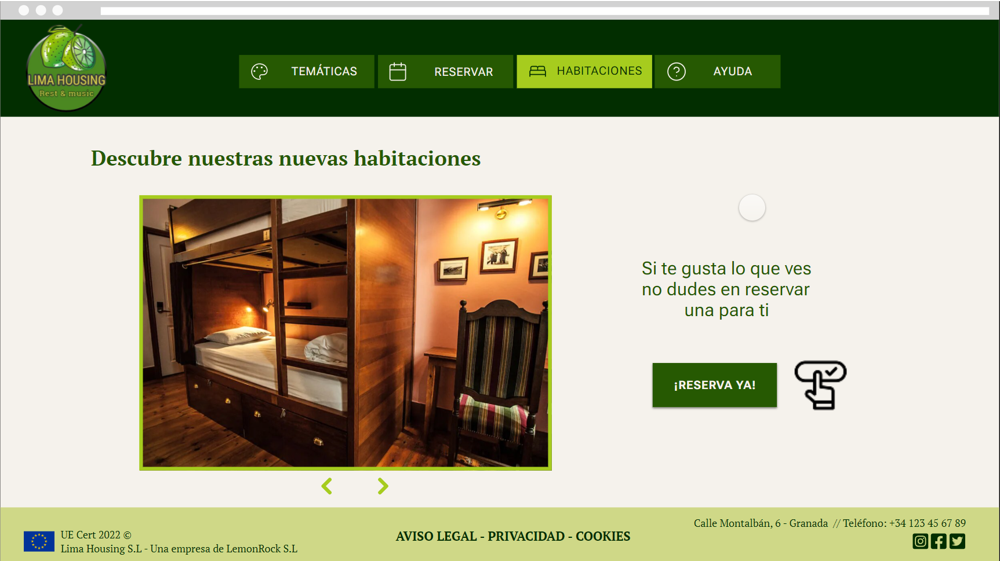
>>>

>>>Para finalizar un apartado de ayuda donde encontraremos una sección de FAQ y otra de contacto
>>>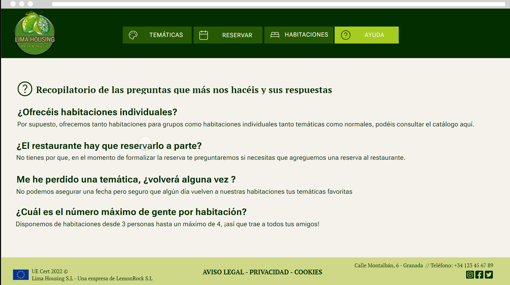
>>>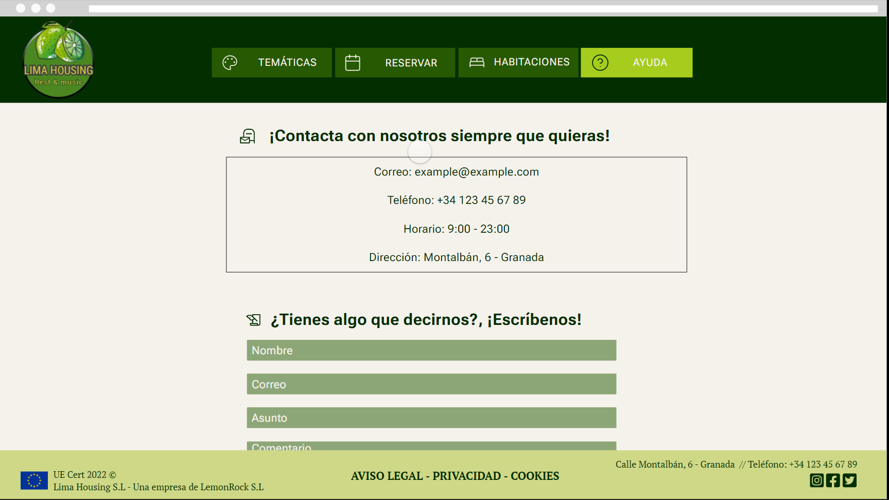

 3.e ¿My UX-Case Study?
-----

>>> Esta última sección consistía en publicar nuestro Case Study. Para ello hemos publicado
todo el contenido de este documento en el repositorio Git [DIU1_Sigma](https://github.com/SigmaDIU1/DIU). Además, se ha creado un vídeo en formato mp4 a modo de presentación del prototipo con algunas de las interacciones de mayor interés en el sistema.
>>> [LIMA HOUSING VIDEO](P3/publishing/limahousing_publising.mp4)
>>> [LIMA HOUSING PÁGINA](https://cloud.protopie.io/p/708ece9477)

## Paso 4. Evaluación 

 4.a Caso asignado
----

>>> Vamos a evaluar el website de LEMON ROCK: EL REGRESO DEL HOSTEL, se centra en un microsite donde los usuarios puedan informarse de la reapertura de las habitaciones de hospedaje, además de poder reservar y encontrar ofertas inigualables. Se puede consultar su repositorio [aquí](https://github.com/amt911/DIU-Estrellas)

 4.b User Testing
----

>>> 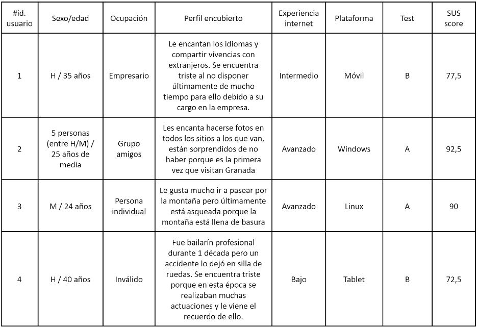

>>> Las necesidades y expectativas de cada usuario las comentamos a continuación:

>>> **Usuario 1:** Cuando entra a la app web busca un proceso de reserva rápido y sencillo debido a su falta de tiempo, también busca información sobre actividades donde poder compartir tiempo con gente y poder cumplir con su hobbie de establecer conversación con extranjeros / turistas de otros países.

>>> **Usuario 2:** Son un grupo de amigos jóvenes, buscan un sitio que les muestre las mejores ofertas, con mucha información visual sobre las habitaciones y sobre el local en sí ya que les apasiona la fotografía, buscan además un sitio donde poder hospedarse todos juntos y donde puedan conocer a otros grupos de gente joven con la que compartir tiempo.

>>> **Usuario 3:** Tras la decepción / asco de encontrarse los alrededores de la ciudad sucios, espera poder desconectar y encontrar un sitio de paz en el LemonRock, alquilando de paso una habitación para pasar la noche. Puesto que no tiene mucha paciencia ni ganas de tener que invertir mucho tiempo en este proceso, espera realizar la reserva y además ver información adicional tanto del restaurante como de los eventos de forma clara.

>>> **Usuario 4:** Espera encontrar información sobre si las habitaciones y el local están adaptados a personas con movilidad reducida, que el proceso de reserva se pueda realizar de forma sencilla desde un móvil o tablet e información sobre si en el hostel se ofertan actividades musicales a las que pueda asistir ya que le encanta la música y el baile.

. 4.c Cuestionario SUS
----

>>> Usaremos el **Cuestionario SUS** para valorar la satisfacción de cada usuario con el diseño (A/B) realizado. 
>>> 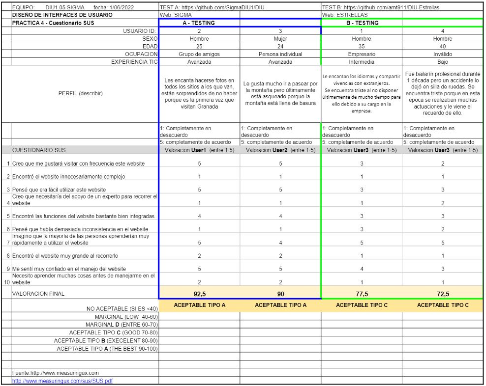

>>>Con todo esto, podemos decir que en general tanto la aplicación A como la B son aplicaciones buenas y que pueden llegar a ser útiles para el objetivo marcado. El ganador es claramente el sitio A, sin embargo, el trabajo realizado por los desarrolladores de la aplicación B es muy bueno a falta de pulir los aspectos que más han fallado

>>>En cuanto a la aplicación A, la estructura, la navegación y la funcionalidad y algunas cuestiones de diseño y de marcado de secciones importantes son mejores que las de la aplicación B.

>>>En cuanto a la aplicación B, la disposición del sitio web (más parecido a un formato real de web), el diseño de la sección de ofertas y habitaciones, y la navegabilidad sobre el contenido mostrado son mejores que las de la aplicación A.

 4.d Usability Report
----

>> Se puede consultar el estudio realizado en el siguiente [documento](P4/P4_UsabReport_{ElRegresoDelHostel}_doneby_{DIU1.05}_{Sigma}.pdf). 

>>> En general la aplicación web diseñada está bastante bien, la información situada en el repositorio github es buena y acorde en líneas generales exceptuando los fallos que hemos detectado en la sección anterior. Como punto a favor de su diseño, la sección de “Habitaciones” y de “Ofertas” está muy lograda, es muy bonita en cuanto a diseño y es muy intuitiva de usar. Sin embargo, el hacer un login/registro que no tiene justificación aparente en la documentación proporcionada ni en el prototipo (además de colocarlo en una sección con un etiquetado incorrecto), y lo más fundamental,  no haber indicado dónde se situaría la gestión de la reserva, hace que la puntuación final del sitio se vea bastante reducida. 

## Conclusión final / Valoración de las prácticas

>>> (90-150 palabras) Opinión del proceso de desarrollo de diseño siguiendo metodología UX y valoración (positiva /negativa) de los resultados obtenidos  

