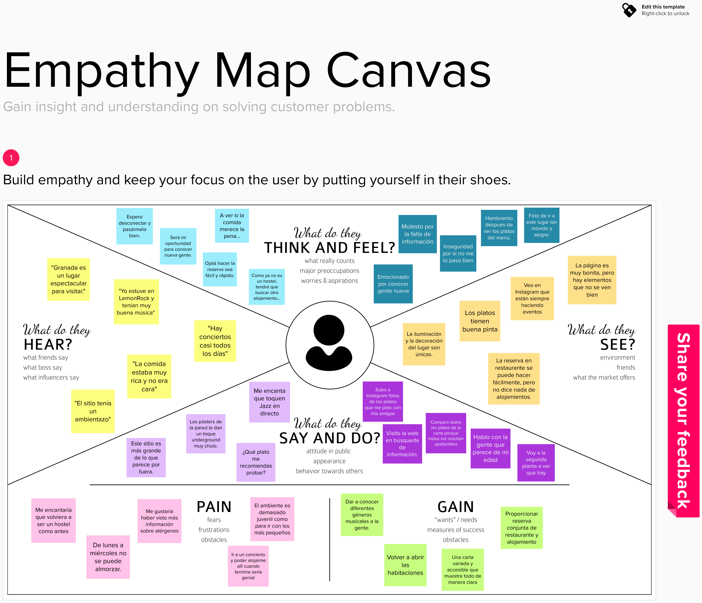

# DIU22
Prácticas Diseño Interfaces de Usuario 2021-22 (Tema: Hostels) 

Grupo: DIU1_Sigma.  Curso: 2021/22 
Updated: 11/2/2022

Proyecto: 
>>> Decida el nombre corto de su propuesta en la práctica 2 

Descripción: 

>>> Describa la idea de su producto en la práctica 2 

Logotipo: 
>>> Opcionalmente si diseña un logotipo para su producto en la práctica 3 pongalo aqui

Miembros
 * :bust_in_silhouette:   Daniel Pérez Ruiz     :octocat:     
 * :bust_in_silhouette:  Emilio Vargas Ibáñez     :octocat:

-----

# Proceso de Diseño 

## Paso 1. UX Desk Research & Analisis 

 1.a Competitive Analysis
-----

>>> El local desde hace unos meses ha dejado de ser un hostel para dedicarse unicamente a la restauración, es un sitio que concentra gente joven y dedican especial importancia a la música en
>>> directo durante las comidas, se centran en platos elaborados de precio no muy elevado y copas. La página web se centra sobre todo en mostrar la comida y el ambiente con gran cantidad
>>> de imágenes, está bien hecha, no hemos encontrado bugs, pero para hacer una reserva hay que ir a una página externa lo cual puede ser un poco molesto ya que si queremos volver atrás
>>> debemos hacerlo desde las flechas del navegador. Además en la propia página de la reserva no parece que tenga ningún método para impedir datos erróneos como que la reserva vaya a nombre de una cadena de números

 1.b Persona
-----

>>> ### Olivia
>>>
>>> La hemos elegido ya que es una chica joven, que encaja en el perfil de las personas que suelen ir al LemonRock según hemos observado en redes sociales, puesto que es una persona a la que le gusta mucho hacer amigos y conocer gente, por tanto puede ser un lugar atractivo para alguien como ella.
>>> En cuanto al perfil psicológico, hemos recreado el caracter de una persona que espera que sus trámites por internet se resuelvan sin inconvenientes, ya que de lo contrario le produce inquietud, frustación, y una alta tendencia a rechazar aquellos lugares donde la navegación no sea cómoda. Se verá más detalladamente este concepto en el Exp Journey Map.
>>>
>>> 
>>> 

>>> ### Enrique
>>>
>>> Es un hombre que disfruta de salir siempre que puede y que está acostumbrado a viajar, además de ser un amante de la comida, por tanto personas como él pueden verse atraidas por este tipo de locales cuya oferta se centra en la "espontaniedad" y el flujo constante de gente.
En cuanto al perfil psicológico, a diferencia del otro personaje, es una perosna que tiene un claro manejo de las tecnologías TIC, y es capaz de comprender, analizar y resolver de forma
propia los inconvenientes que puedan surgir.
>>>
>>>
>>>

 1.c User Journey Map
----

>>> ### Olivia
>>> Hemos querido recrear los pasos que seguiría para buscar un alojamiento una persona que no tiene mucha idea de tecnologías y cuya principal influencia es su círculo más cercano,
al ser una persona más emocial sus conflictos le afectan más al no poder reservar comodamente, lo que hace que personas como ella puedan acabar rechazando el sitio. 
>>>
>>>
>>>

>>> ### Enrique
>>> Ya que tiene amplio conocimiento sobre las tecnologías y sabe usarlas hemos querido hacerle usar sitios web de terceros para buscar alojamiento, por ello no le cuesta encontrar el
LemonRock y descubrir en su página que ya no ofrecen servicio de hostel, en cuanto a sus emociones al ser una persona más racional es capaz de buscar alternativas fácilmente, este
tipo de personas pueden ver más alla de que simplemente ya no sea un hostel y reservar ahí igualmente porque les gusta la comida y el ambiente que muestra. 
>>>
>>>
>>>

 1.d Usability Review
----
>>>  Documento con los detalles de la valoración: 
>>>[Documento valoración](P1/DOCS/DIU1.SIGMA_P1_(EXCEL).xlsx)
>>>  
>>> La página ha obtenido como calificación numérica final un total de 86/100
>>> 
>>> En términos generales la interfaz de la página web cumple con las expectativas: el contenido que la empresa quiere ofertar está claro, y es accesible, y dispone de formas sencillas, con un estilo limpio y concreto, de acceder a los diferentes servicios. Concluimos también que el encabezado puede ser un poco grande en proporción con el cuerpo de la página, y también puede presentar algunos problemas de visionado de contenido con algunas transparencias que se proudcen en la barra de navegación situada también en el encabezado. La página dispone de información suficiente como para localizar adecuadamente el sitio mostrando diferentes formas de acceso (en coche por autovía, desde el aeropuerto, desde estación de autobuses...) además de emails, tlf y formularios de contacto, aspecto que puede ser clave para que el cliente decida ir al lugar.

En cuanto a las herramientas utilizadas en la página web, podemos ver que el contenido es totalmente dinámico, con carruseles de vídeos, imágenes, etiquetas llamativas, transiciones de textos, aspecto que ayuda a que la experiencia del usuario navegando con la página, sea más relajada. Además, la disposición de los elementos y la sencillez de la web, hace que cualquier usuario pueda utilizarla sin importar cuál sea su nivel de conocimiento en tecnologías TIC, aunque no se menciona en ningún momento el hecho de que LemonRock ya no es un hostel y no dispone de alojamientos, factor que podría ser advertido con un cuadro de diálogo a la hora de realizar una reserva, o una sección a parte, evitando así que ciertos clientes se sientan "engañados" si visitan portales de terceros con información obsoleta.

## Paso 2. UX Design  

 2.a Feedback Capture Grid / EMpathy map / POV
----

>>>  

>>> El proyecto consistirá en volver a abrir las habitaciones pero con el añadido de que algunas de ellas tendrán una decoración musical temática que irá cambiando a lo largo del tiempo con el objetivo de atraer y captar a los clientes interesados en dicha temática, además de instar a otros que ya hayan estado en el local (o se hayan alojado) a disfrutar de otra temática diferente, con el beneficio extra de que dichos clientes se conviertan en comensales del restaurante o espectadores de los eventos que se realicen en el local.

 2.b ScopeCanvas
----
>>>  

 2.b Tasks analysis 
-----

>>> Hemos optado por una matriz de tareas, en total tenemos un total de 12 de acciones que puede realizar el usuario que navega por el microsite, las hemos clasificado con tres valores: H (prioridad alta), M (prioridad media) y L (prioridad baja), las casillas marcadas en gris oscuro son las tareas críticas y los grupos de usuarios más importantes.
>>> 
>>> 

 2.c IA: Sitemap + Labelling 
----

>>>Este es el grafo con la estructura de nuestro microsite. Disponemos de 4 secciones bien
diferenciadas entre las que el usuario podrá interaccionar: Temáticas para consultar las
temáticas actuales y anteriormente ofertadas sobre las habitaciones; Reservar para realizar
una reserva de la habitación, Habitaciones para que el usuario pueda visualizarlas y Ayuda, sección dedicada a preguntas frecuentes y un formulario de contacto.
>>>
>>>
>>>
>>> Expondremos las principales etiquetas que hemos usado en nuestro
microsite y una breve descripción para comprender la finalidad de cada una.
>>>
>>> 

 2.d Wireframes
-----

>>> Todas las páginas del microsite contienen una cabecera (Header) con una barra de navegación para moverse cómodamente entre las diferentes secciones bien definidas: Temática, Habitaciones, Reservar, Ayuda. Además, pulsar en el logo redirige a la página principal del sitio oficial de LemonRock.
>>> También se dispone de un pie de página (Footer) en el que se contiene información básica
>>> acerca de cuestiones intrínsecas de la propia web (política de privacidad, cookies almacenadas, aviso legal), además de información referente al local, y redirección a redes sociales.
>>>
>>> Información completa en [documento bocetos](P2/Bocetos/DIU1.SIGMA_Bocetos.pdf).
>>>
>>>.drawio.png)
>>>
>>>.drawio.png)
>>>
>>>.drawio.png)
>>>
>>>.drawio.png)
>>>
>>>.drawio.png)
>>>
>>>.drawio.png)
>>>
>>>.drawio.png)
>>>
>>>.drawio.png)
>>>
>>>.drawio.png)
>>>
>>>.drawio.png)

## Paso 3. Mi UX-Case Study (diseño)

 3.a Moodboard
-----

>>> Plantear Diseño visual con una guía de estilos visual (moodboard) 
>>> Incluir Logotipo
>>> Si diseña un logotipo, explique la herramienta utilizada y la resolución empleada. ¿Puede usar esta imagen como cabecera de Twitter, por ejemplo, o necesita otra?

  3.b Landing Page
----

>>> Plantear Landing Page 

 3.c Guidelines
----

>>> Estudio de Guidelines y Patrones IU a usar 
>>> Tras documentarse, muestre las deciones tomadas sobre Patrones IU a usar para la fase siguiente de prototipado. 

  3.d Mockup
----

>>> Layout: Mockup / prototipo HTML  (que permita simular tareas con estilo de IU seleccionado)

 3.e ¿My UX-Case Study?
-----

>>> Publicar my Case Study en Github..
>>> Documente y resuma el diseño de su producto en forma de video de 90 segundos aprox

## Paso 4. Evaluación 

 4.a Caso asignado
----

>>> Breve descripción del caso asignado con enlace a  su repositorio Github

 4.b User Testing
----

>>> Seleccione 4 personas ficticias. Exprese las ideas de posibles situaciones conflictivas de esa persona en las propuestas evaluadas. Asigne dos a Caso A y 2 al caso B

| Usuarios | Sexo/Edad     | Ocupación   |  Exp.TIC    | Personalidad | Plataforma | TestA/B
| ------------- | -------- | ----------- | ----------- | -----------  | ---------- | ----
| User1's name  | H / 18   | Estudiante  | Media       | Introvertido | Web.       | A 
| User2's name  | H / 18   | Estudiante  | Media       | Timido       | Web        | A 
| User3's name  | M / 35   | Abogado     | Baja        | Emocional    | móvil      | B 
| User4's name  | H / 18   | Estudiante  | Media       | Racional     | Web        | B 

. 4.c Cuestionario SUS
----

>>> Usaremos el **Cuestionario SUS** para valorar la satisfacción de cada usuario con el diseño (A/B) realizado. Para ello usamos la [hoja de cálculo](https://github.com/mgea/DIU19/blob/master/Cuestionario%20SUS%20DIU.xlsx) para calcular resultados sigiendo las pautas para usar la escala SUS e interpretar los resultados
http://usabilitygeek.com/how-to-use-the-system-usability-scale-sus-to-evaluate-the-usability-of-your-website/)
Para más información, consultar aquí sobre la [metodología SUS](https://cui.unige.ch/isi/icle-wiki/_media/ipm:test-suschapt.pdf)

>>> Adjuntar captura de imagen con los resultados + Valoración personal 

 4.d Usability Report
----

>> Añadir report de usabilidad para práctica B (la de los compañeros)

>>> Valoración personal 

>>> ## Paso 5. Evaluación de Accesibilidad  (no necesaria)

>>>   5.a Accesibility evaluation Report 
>>>
>>> > ----

>>> Indica qué pretendes evaluar (de accesibilidad) sobre qué APP y qué resultados has obtenido 

>>> 5.a) Evaluación de la Accesibilidad (con simuladores o verificación de WACG) 
>>> 5.b) Uso de simuladores de accesibilidad 

>>> (uso de tabla de datos, indicar herramientas usadas) 

>>> 5.c Breve resumen del estudio de accesibilidad (de práctica 1) y puntos fuertes y de mejora de los criterios de accesibilidad de tu diseño propuesto en Práctica 4.

## Conclusión final / Valoración de las prácticas

>>> (90-150 palabras) Opinión del proceso de desarrollo de diseño siguiendo metodología UX y valoración (positiva /negativa) de los resultados obtenidos  

